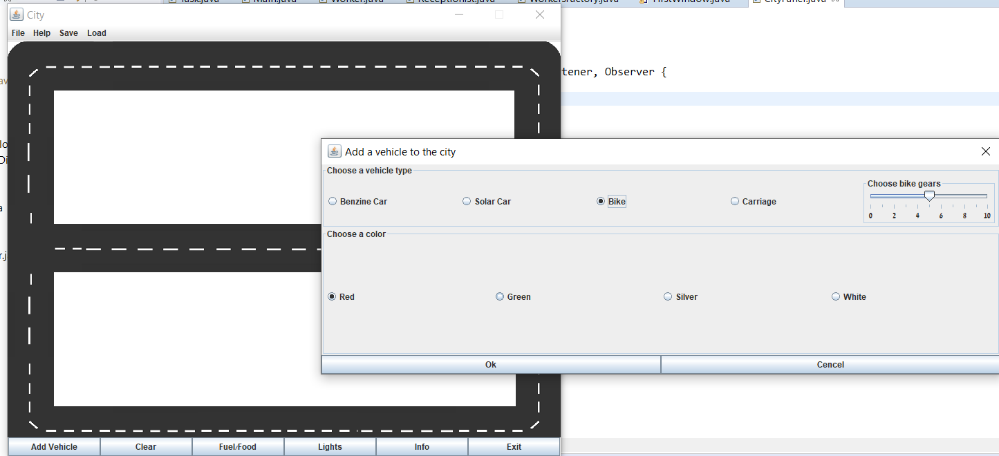
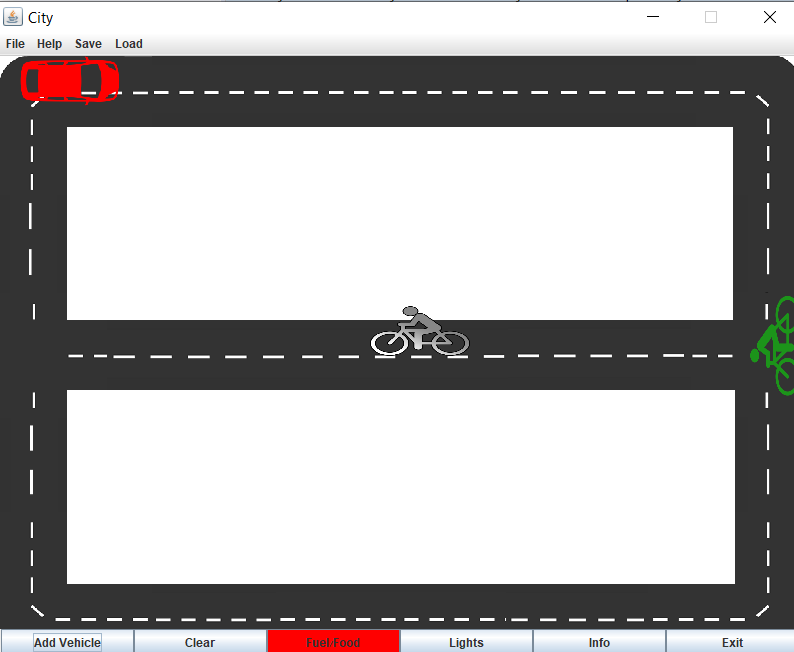
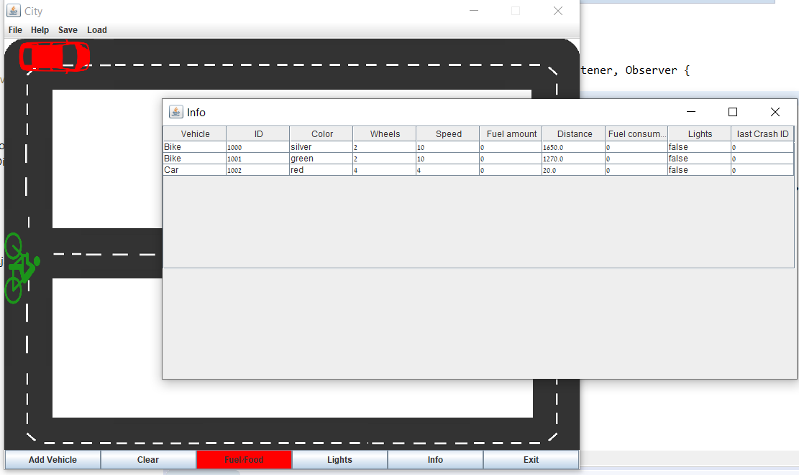

# City Transportation Simulator.
Users can add different types of vehicles to the city, track and
analyze their journey.

## Screenshots

## In Project
* Java
* Multithreading
* Design Patterns
* Data Structures
* GUI
